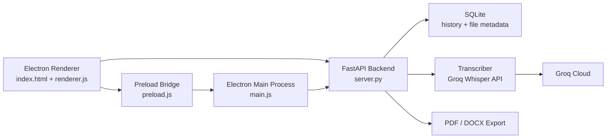

# SpeechDetect

<p align="center">
  Desktop speech-to-text app built with Electron + FastAPI.<br>
  Drop in an audio file, transcribe it with Groq Whisper, keep the history locally, and export the result to PDF or DOCX.
</p>

<p align="center">
  
  
  
  
  
</p>

## Overview

SpeechDetect is a compact desktop application for turning audio into text without pushing the whole product into the cloud. The UI is packaged as an Electron app, the transcription backend runs locally via FastAPI, and only the speech recognition step reaches out to the Groq API.

The project is designed around a very practical workflow:

- upload or drag-and-drop an audio file
- send it to a local backend running on `127.0.0.1:8765`
- transcribe it with `whisper-large-v3-turbo`
- store the file metadata and transcript in SQLite
- export the result as PDF or DOCX

## Why This Project

- Clean desktop UX instead of a browser-based tool
- Local history with uploaded files and transcripts
- Progress tracking for long-running transcriptions
- Automatic chunking for large audio files
- Simple packaging flow for distributable Windows and macOS builds

## Feature Set

| Feature | Details |
| --- | --- |
| Audio upload | Supports `.wav`, `.mp3`, `.ogg`, `.flac`, `.m4a` |
| Speech-to-text | Uses Groq Whisper `whisper-large-v3-turbo` |
| Large file handling | Splits oversized audio into chunks up to `24 MB` before upload |
| Local persistence | Stores history in SQLite |
| Export | Generates `.pdf` and `.docx` files |
| Desktop packaging | Electron UI + PyInstaller backend |
| Build automation | GitHub Actions workflow for Windows installer builds |

## Architecture



## How It Works

### 1. Desktop shell

`frontend/main.js` starts the backend as a child process when Electron becomes ready.

- In development, Electron uses the Python interpreter from the root-level `.venv`
- In packaged mode, Electron runs a bundled backend executable generated by PyInstaller

### 2. Local backend

`backend/server.py` exposes a small REST API on `http://127.0.0.1:8765`.

- accepts audio uploads
- starts transcription jobs
- tracks progress per record
- serves history
- exports transcripts to PDF and DOCX

### 3. Transcription pipeline

`backend/transcriber.py` handles Groq integration.

- reads `GROQ_API_KEY`
- configures `pydub` to use the `ffmpeg` binary from `imageio-ffmpeg`
- sends small files directly
- slices large files into time-based chunks before sending them to Groq
- aggregates chunk results into one transcript

### 4. Local storage

`backend/database.py` stores transcription history in SQLite.

Each record contains:

- original filename
- file path on disk
- file size
- transcript text
- creation timestamp

## Tech Stack

| Layer | Technology |
| --- | --- |
| Desktop app | Electron 41 |
| Frontend | Vanilla HTML, CSS, JavaScript |
| Backend API | FastAPI + Uvicorn |
| Speech recognition | Groq API |
| Audio processing | `pydub` + `imageio-ffmpeg` |
| Database | SQLite |
| Document export | `fpdf2`, `python-docx` |
| Backend packaging | PyInstaller |
| Installer packaging | electron-builder |
| CI/CD | GitHub Actions |

## Repository Structure

```text
SpeechDetect/
├── backend/
│   ├── database.py         # SQLite helpers
│   ├── server.py           # FastAPI app and REST endpoints
│   ├── transcriber.py      # Groq transcription pipeline
│   ├── server.spec         # PyInstaller configuration
│   ├── requirements.txt
│   └── fonts/              # Fonts used for PDF export
├── frontend/
│   ├── index.html          # Desktop UI shell
│   ├── styles.css          # App styling
│   ├── renderer.js         # Renderer-side UI logic
│   ├── preload.js          # Safe Electron bridge
│   ├── main.js             # Electron main process
│   └── package.json
├── .github/workflows/
│   └── build.yml           # Windows installer build pipeline
└── README.md
```

## Quick Start

### Prerequisites

- Python `3.11`
- Node.js `20+`
- npm
- a Groq API key

### 1. Clone the repository

```bash
git clone https://github.com/Jekov-Evgen/Speech-detected.git
cd Speech-detected
```

### 2. Create the Python environment

Electron expects the development interpreter to live in the repository root as `.venv`.

```bash
python3.11 -m venv .venv
source .venv/bin/activate
pip install -r backend/requirements.txt
```

On Windows:

```bash
.venv\Scripts\activate
pip install -r backend\requirements.txt
```

### 3. Add the API key

Create `backend/.env`:

```env
GROQ_API_KEY=your_key_here
```

Get a key from [console.groq.com/keys](https://console.groq.com/keys).

### 4. Install frontend dependencies

```bash
cd frontend
npm install
```

### 5. Start the desktop app

From the `frontend/` directory:

```bash
npm start
```

In development, Electron will automatically start the FastAPI backend using the Python interpreter from the root `.venv`.

### Optional: run the backend standalone

Useful when you want to inspect the API directly in the browser or work on the backend separately.

```bash
cd backend
python server.py
```

The API will then be available at:

```text
http://127.0.0.1:8765
```

## Build and Packaging

### Local build

Build the backend executable:

```bash
cd backend
pyinstaller server.spec --distpath dist --clean -y
```

Build the desktop installer:

```bash
cd frontend
npm install
npm run build:mac
```

For Windows:

```bash
npm run build:win
```

Build artifacts are written to `release/`.

### GitHub Actions build

The repository includes `.github/workflows/build.yml` for Windows installer builds.

Workflow behavior:

- requires the `GROQ_API_KEY` repository secret
- triggers on tags matching `v*`
- writes `backend/.env` from `GROQ_API_KEY`
- builds the backend with PyInstaller
- packages the Electron app with `electron-builder`
- uploads the resulting `.exe` as a workflow artifact

To use it:

```bash
git tag v1.0.0
git push origin v1.0.0
```

## API Reference

The Electron frontend talks to the local FastAPI backend over HTTP.

| Method | Endpoint | Purpose |
| --- | --- | --- |
| `GET` | `/api/health` | Backend health check |
| `POST` | `/api/upload` | Upload an audio file |
| `POST` | `/api/transcribe/{id}` | Start transcription for a record |
| `GET` | `/api/progress/{id}` | Poll transcription progress |
| `GET` | `/api/history` | Fetch saved history |
| `DELETE` | `/api/history/{id}` | Delete a record and its file |
| `GET` | `/api/export/pdf/{id}` | Export transcript as PDF |
| `GET` | `/api/export/docx/{id}` | Export transcript as DOCX |

FastAPI docs are available in development at:

```text
http://127.0.0.1:8765/docs
```

## Data and Runtime Behavior

### Development mode

By default, data is stored in the `backend/` directory:

- `speechdetect.db`
- `uploads/`
- `.env`

### Packaged mode

When the Electron app is packaged, it uses a writable app data directory:

```text
<Electron userData>/data
```

### Optional override

You can override the writable data directory with:

```bash
SPEECHDETECT_DATA_DIR=/custom/path
```

## Supported Audio Formats

- `.wav`
- `.mp3`
- `.ogg`
- `.flac`
- `.m4a`

## Constraints and Notes

- Internet access is required only for the Groq transcription request
- The app does not run speech recognition locally; it uses the Groq API
- Large files are chunked before upload to stay below the Groq size limit
- The current UI language is Russian

## Roadmap Ideas

- speaker diarization
- transcript editing inside the app
- searchable history
- batch transcription
- richer export templates

## License

ISC
